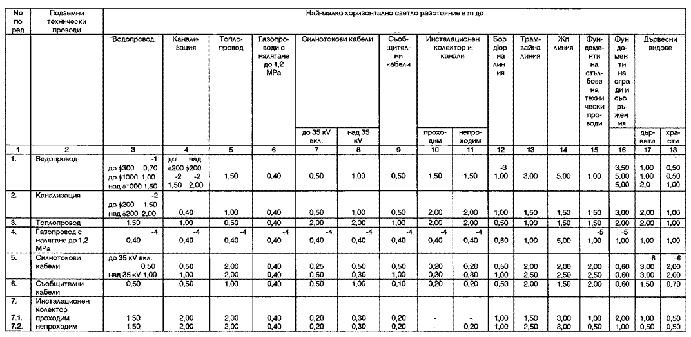
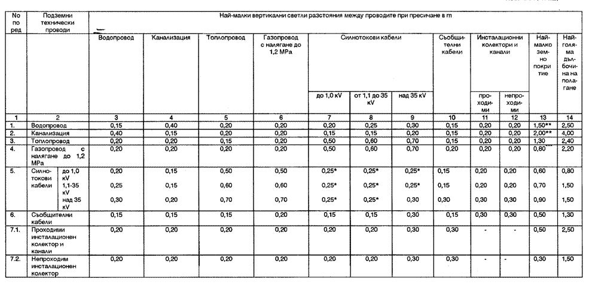
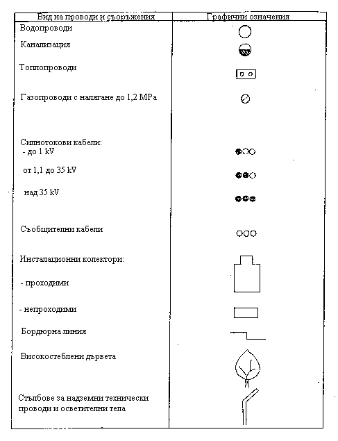
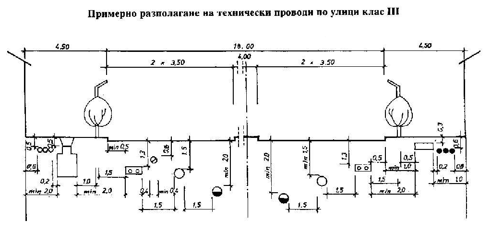
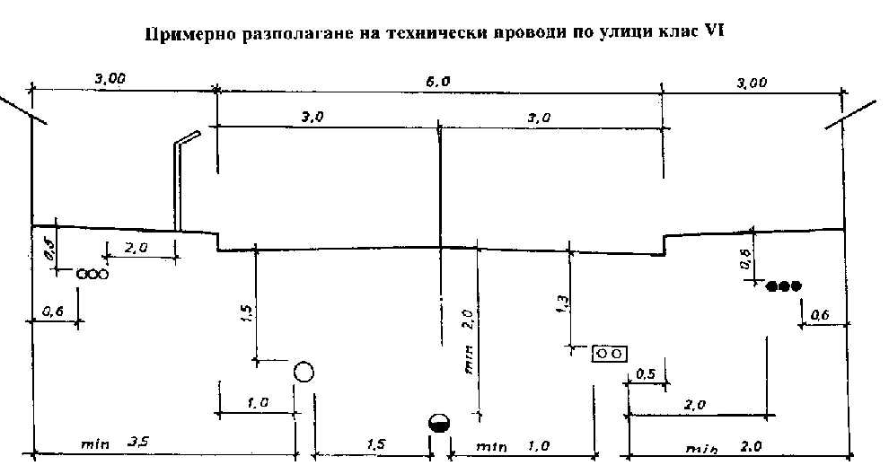

# Наредба № 8 от 28 юли 1999 г. за правила и норми за разполагане на технически проводи и съоръжения в населени места

<!-- knowledge-note: machine-extracted text; normative wording is not rewritten; unresolved formulas and figures stay marked and point at the original file -->
НАРЕДБА № 8 ОТ 28 ЮЛИ 1999 Г. ЗА ПРАВИЛА И НОРМИ ЗА РАЗПОЛАГАНЕ НА ТЕХНИЧЕСКИ ПРОВОДИ И

СЪОРЪЖЕНИЯ В НАСЕЛЕНИ МЕСТА

В сила от 12.09.1999 г.

Издадена от министъра на регионалното развитие и благоустройството

Обн. ДВ. бр.72 от 13 Август 1999г.

### Раздел I.

Общи положения

#### Чл. 1.

(1) С тази наредба се определят изискванията за проектиране, за изграждане на нови и за реконструкция на съществуващи подземни

и надземни технически проводи и съоръжения на инженерните системи в населени места.

(2) Наредбата се прилага за разполагане на подземни технически проводи и съоръжения в габаритите на улиците и извън тях (пешеходни зони, алеи, озеленени площи и други територии в населените места), както и за разполагане на сградните отклонения от тях.

(3) При проектиране на разполагането на подземни и надземни технически проводи и съоръжения се спазват освен изискванията на тази наредба и изискванията на съответните нормативни актове за съответните инженерни системи, когато те не й противоречат.

#### Чл. 2.

Наредбата може да се прилага за подземните технически проводи и съоръжения в софийското метро, за подземни транспортни

тунели и подлези, както и за подземни проводи и съоръжения извън строителните граници на населените места, доколкото тя не противоречи на техническите нормативни актове за тези проводи и съоръжения.

#### Чл. 3.

(1) Подземни технически проводи и съоръжения, които се разполагат под уличното платно, са:

1. водопроводни мрежи и съоръжения;

2. канализационни мрежи и съоръжения;

3. топлопроводни мрежи и съоръжения;

4. газопроводни мрежи и съоръжения;

5. отклоненията от инженерните системи към сградите, строителните и промишлените площадки в частта им под уличното платно и тротоарите.

(2) Подземни проводи и съоръжения, които се разполагат под тротоарите, са:

1. силнотоковите кабели за ниско напрежение - до 1 кV;

2. силнотоковите кабели за средно напрежение - от 1 до 35 кV вкл.;

3. силнотоковите кабели за високо напрежение - над 35 кV;

4. силнотоковите кабели за електротранспорт;

5. съобщителните кабели;

6. сигналните и контролните кабели до 1 кV.

7. газопроводните мрежи и съоръжения;

8. инсталационните канали и колектори за кабелите по т. 1 - 6.

(3) При улици с банкети, пешеходни улици, улици без тротоар, озеленени площи и други територии подземните проводи и съоръжения се разполагат при спазване на изискванията на глави втора и трета.

#### Чл. 4.

(1) Надземни технически проводи и съоръжения, които се носят от стълбове, разположени на тротоарите, са:

1. съобщителните, радио- и транслационните проводници и кабели;

2. сигналните и контролните проводници и кабели - до 1 кV.

3. проводниците и кабелите за ниско напрежение - до 1 кV;

4. проводници и кабели за средно напрежение - от 1,1 до 35 кV;

5. проводниците и кабелите за високо напрежение - над 35 кV;

6. контактната мрежа за електротранспорт;

7. съоръженията за регулиране движението на транспортните средства и пешеходците - светофари, указателни табели, знаци и др., захранвани от електропроводи;

8. осветителните тела.

(2) Надземни технически съоръжения, обслужващи различни кабелни мрежи, които се разполагат на тротоарите, са: разпределителните и контролните табла, вентилационните и контролните шахти и др.

(3) Допуска се една стълбова линия да носи няколко надземни технически провода, като се спазват изискванията на техническите нормативни актове за съответните проводи и съоръжения.

#### Чл. 5.

(1) Шахтите за достъп до подземните технически проводи се разполагат с възможности за извършване на ревизии и други

дейности, свързани с тяхното предназначение.

(2) Нивото на входните отвори, респ. капаците на шахтите и охранителните гарнитури на спирателните пожарни кранове, трябва да съвпада с нивото на уличното платно, тротоара или пешеходната зона. В озеленените площи нивото на отворите, респ. капаците, се проектира най-малко на 0,15 m над проектното ниво на терена.

### Раздел II.

Най-малки светли разстояния и земни покрития на проводите

#### Чл. 6.

(1) Най-малките хоризонтални светли разстояния между успоредно разположени технически проводи в план и отстоянието им от

други съоръжения се определят по приложение № 1.

(2) Най-малките вертикални светли разстояния между подземните технически проводи при пресичане, най-малките земни покрития и най-големите дълбочини на полагане на подземните технически проводи се определят по приложение № 2.

(3) Нормите по ал. 1 и 2 се отнасят и за сградните отклонения.

(4) Местоположението на подземните технически проводи и сградните отклонения се означава трайно със сигнални ленти (пластмасови

с метална нишка и др.) на 0,3 - 0,5 m под повърхността на терена с оглед установяване на местоположението им при извършване на ремонт, земни и други видове строителни работи.

### Раздел III.

Инсталационни канали и колектори за технически проводи

#### Чл. 7.

(1) Инсталационните канали и колектори са съоръжения за свободно разполагане на подземни технически проводи.

(2) В инсталационните канали от тръби - единични или в пакет, се монтира само по един електропровод с напрежение до 35 кV в тръба.

(3) В инсталационните колектори се монтират:

1. водопроводи;

2. топлопроводи;

3. съобщителни кабели;

4. силнотокови кабели до 35 кV вкл.;

5. силнотокови кабели за електротранспорт;

6. сигнални и контролни кабели;

7. проводи за битови и промишлени отпадъчни води на канализационни системи;

8. газопроводи с налягане до 1,2 МРа.

#### Чл. 8.

Най-малките светли хоризонтални разстояния от външната страна на инсталационни канали и колектори до успоредно

разположени технически проводи и съоръжения се определят по приложение № 1, а най-малките вертикални светли разстояния при пресичане на инсталационни канали и колектори с други инженерни проводи и най-малкото им земно покритие - по приложение № 2.

#### Чл. 9.

(1) Не се допуска инсталационен канал или колектор да преминава под местата на пресичане на релсови пътища.

(2) Мястото на пресичане на инсталационни канали или колектори с трамвайни линии трябва да е на разстояние най-малко 3 m от външната релса на трамвайното кръстовище.

#### Чл. 10.

В инсталационен колектор не се разрешава разполагане на тръбопроводи, пренасящи избухливи и леснозапалими течности и

газове, съвместно със силнотокови кабели.

### Раздел IV.

Местоположение на подземните технически проводи

#### Чл. 11.

(1) Местоположението на техническите проводи в напречния профил на улицата в план се определя от хоризонталното светло

разстояние между провода, оста на улицата, регулационната и бордюрната линия и положението на останалите проводи, а вертикалното - от наймалкото земно покритие на провода, най-голямата дълбочина на полагане и нивото на уличното платно по оста, нивото на бордюра или нивото на покритието на пешеходната улица, алея или друга територия от населеното място.

(2) Примерно разполагане на техническите проводи при различни широчини на улиците (разстоянието между регулационните линии) е дадено в приложение № 3.

(3) Минималните земни покрития се спазват при самостоятелно полагане на провода. При два и повече провода с еднакво предназначение земното покритие се осигурява от изискванията за минималното земно покритие на всеки технически провод и от най-малкото вертикално светло разстояние при пресичане съгласно приложение № 2.

(4) При успоредно полагане водопроводът задължително се разполага над провода за отпадъчни води.

#### Чл. 12.

(1) Водопроводите, топлопроводите и газопроводите се разполагат от едната или другата страна на осовата линия на улицата.

(2) Проводите за отпадъчни води се разполагат по оста на улицата.

(3) Силнотоковите и слаботоковите проводи се разполагат под единия и/или другия тротоар.

(4) За улици с широчина над 16 m техническите проводи могат да се дублират от двете страни на уличната ос.

(5) При наличието на релсов път техническите проводи могат да се дублират от двете страни на линиите и при улици с широчина, помалка от 16 m.

(6) Допуска се П-образните компенсатори на топлопроводи и други проводи да се разполагат над или под други проводи при спазване на изискванията за светлите вертикални разстояния на пресичане на проводите съгласно приложение № 2.

(7) Допуска се подземните инсталационни канали за силнотокови и съобщителни кабели да се разполагат допрени при недостатъчна широчина на тротоарите, като се спазват изискванията на Правилника за защита на съобщителните линии от смущаващо електромагнитно влияние на електропроводни линии и за допустими минимални сближения.

#### Чл. 13.

Не се допуска разполагането на:

1. различни технически проводи и съоръжения на една и съща дълбочина;

2. технически проводи и съоръжения успоредно един под друг, ако не са в отделни инсталационни канали или в инсталационен колектор.

Заключителни разпоредби

#### § 1.

(1) Тази наредба се издава на основание чл. 201, ал. 1 от Закона за териториално и селищно устройство и отменя Правила и норми за

подземни и надземни улични проводи и съоръжения (ДВ, бр. 39 от 1965 г.).

(2) Наредбата отменя всички текстове от техническите нормативни актове за съответните подземни и надземни проводи и съоръжения, които й противоречат.

#### § 2.

(1) Указания по прилагане на наредбата дава министърът на регионалното развитие и благоустройството.

(2) Разрешения за отклонения от нормите на наредбата за съществуващи улици с нестандартни параметри при утежнени инженерногеоложки условия и неправилно разположени съществуващи проводи се дават от органа по ал. 1 въз основа на становище от техническата служба на общината.

#### § 3.

Наредбата влиза в сила един месец след обнародването й в "Държавен вестник".

## Приложение № 1 към чл. 6, ал. 1 и чл. 8

Забележка. При силнотокови кабели за електротранспорт най-малките светли разстояния са както по т. 5 (до 35 кV вкл.)

1 - Разстоянията се отнасят за успоредно положени водопроводи, чиито диаметри са съответно под f 300, под f 1000 и над f 1000;

2 - Посочените диаметри се отнасят за канализационна тръба;

3 - За улици с широчина на платното до 5,0 m разстоянието се приема 0,55 m;

4 - Допуска се намаляване на разстоянието до 0,2 m при стеснени условия в застроени части на населените места;

5 - Разстоянието до фундаменти на сгради и съоръжения може да се намали до 0,5 m при условие, че в участъка на сближението подземният газопровод е от безшевни тръби, защитен е с кожух или са предвидени минимален брой заварени съединения;

6 - По изключение за тротоари, по-тесни от 5,0 m, разстоянието е не по-малко от 1,0 m

## Приложение № 2 към чл. 6, ал. 2, чл. 8, чл. 11, ал. 3 и чл. 12, ал. 6

Забележка. При силнотокови кабели за електротранспорт разстоянията и покритията са както по т. 5 (до 35 кV вкл.)

* между пресичащите се кабели трябва да има защитна преграда;

** най-малкото земно покритие, когато се полагат под тревни и цветни площи и други терени, ненатоварени от транспортни, строителни и други товари се допуска да е:

- за водопроводи - 1,20 m

- за канали - 1,70 m;

*** допуска се в участъците, през които не се предвижда преминаване на транспортни средства (озеленени площи и др.), дълбочината на полагане да се намали на 0,6 m.

## Приложение № 3 към чл. 11, ал. 2

ПРИМЕРНИ СХЕМИ за полагане на подземни и надземни технически проводи и съоръжения в населени места

Означения

Забележка. Когато две и повече графични означения съвпадат напълно или частично, се приема, че ще се изпълнява само един от техническите проводи или съоръжения.

Примерно разполагане на технически проводи по улици клас III

Примерно разполагане на технически проводи по улици клас VI

## Графични приложения без текстов слой

Следните изображения са в оригиналния PDF и нямат отделен текстов слой. Стойностите от тях не са преписвани.

### Изображение 1, страница 3 на PDF

### Изображение 2, страница 3 на PDF

### Изображение 3, страница 4 на PDF

### Изображение 4, страница 4 на PDF

### Изображение 5, страница 5 на PDF

