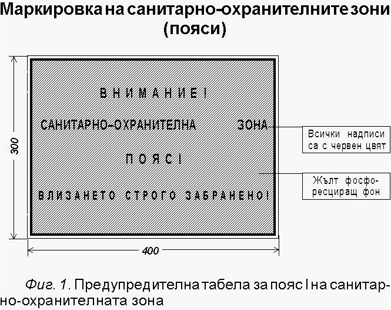
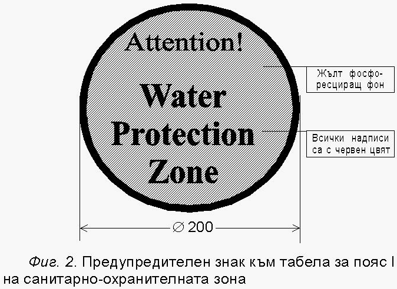
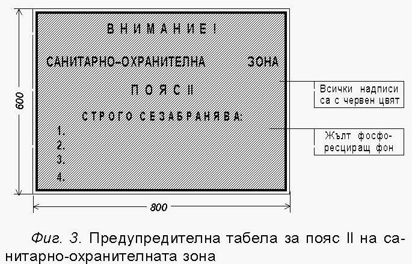
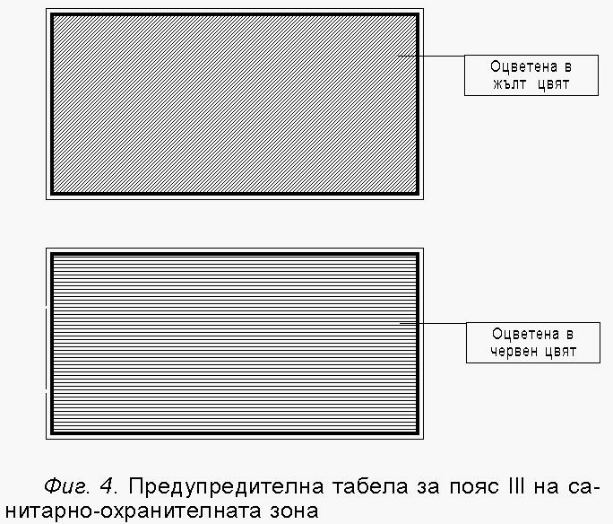

# Наредба № 3 от 16.10.2000 г. за условията и реда за проучване, проектиране, утвърждаване и експлоатация на санитарно-охранителните зони около водоизточниците и съоръженията за питейно-битово водоснабдяване и около водоизточниците на минерални води, използвани за лечебни, профилактични, питейни и хигиенни нужди

<!-- knowledge-note: machine-extracted text; normative wording is not rewritten; unresolved formulas and figures stay marked and point at the original file -->
НАРЕДБА № 3 от 16.10.2000 г. за условията и реда за проучване, проектиране, утвърждаване и експлоатация на санитарно-охранителните зони около водоизточниците и съоръженията за питейно-битово водоснабдяване и около водоизточниците на минерални води, използвани за лечебни, профилактични, питейни и хигиенни нужди

Издадена от министъра на околната среда и водите, министъра на здравеопазването и министъра на регионалното развитие и благоустройството, обн., ДВ, бр. 88 от 27.10.2000 г.

## Глава първа. ОБЩИ ПОЛОЖЕНИЯ

#### Чл. 1.

(1) С тази наредба се определят условията и редът за проучване, проектиране, учредяване,

утвърждаване и експлоатация на санитарно- охранителните зони (СОЗ) около водоизточниците и съоръженията за:

1. питейно-битово водоснабдяване от повърхностни води;

2. питейно-битово водоснабдяване от подземни води;

3. минерални води, използвани за лечебни, профилактични, питейни и хигиенни нужди.

(2) Разпоредбите на тази наредба не се прилагат за индивидуални и обществени местни водоизточници, освен ако водата от тях не се използва за търговска или социална дейност с цел питейна употреба.

#### Чл. 2.

(1) Водоизточници по чл. 1 са:

1. повърхностните водни обекти или части от тях;

2. водовземните съоръжения за подземни, в т.ч. и минерални, води.

(2) Съоръженията по чл. 1 са надземните съоръжения, чрез които се отнемат води от водоизточника, и средствата за измерване към тях, в т.ч. и съоръженията за акумулиране и/или третиране на води, предназначени за питейно-битово водоснабдяване.

#### Чл. 3.

(1) Санитарно-охранителните зони обхващат:

1. акваторията и територията около водоизточниците и съоръженията за питейно-битово водоснабдяване от повърхностни води;

2. територията и/или подземния воден обект около водоизточниците за питейно-битово водоснабдяване от подземни води и за минерални води, използвани за лечебни, профилактични, питейни и хигиенни нужди, и територията около надземните съоръжения.

(2) Санитарно-охранителните зони осигуряват:

1. физическа охрана на водоизточника и/или съоръжението;

2. защита срещу постъпване на замърсители във водоизточниците;

3. гарантиране на проектното количество и качеството на водите във водовземните съоръжения за срока на действие на разрешителното за водоползване;

4. запазване на водоизточника в състояние, позволяващо ползването му за питейни цели от бъдещите поколения.

(3) Границите на СОЗ се определят и оразмеряват при условията и по реда на глава четвърта.

#### Чл. 4.

(1) В СОЗ се определят и учредяват охранителни режими, с които се забраняват, ограничават,

наблюдават, спират и контролират дейности, които унищожават, увреждат или застрашават да предизвикат в дългосрочен план отрицателна промяна на качеството и/или количеството на водите, непосредствено или

като увредят елементите на околната среда.

(2) Охранителните режими за подземните води се разпростират и върху проучването, добива и използването на подземните, в т.ч. и минералните, води.

#### Чл. 5.

Забранява се експлоатация на водоизточник и/или съоръжение, независимо от формата на

собствеността му, без установена СОЗ.

#### Чл. 6.

(1) Изграждането на водоизточници за питейно-битово водоснабдяване в регулационните

граници на населените места се допуска по изключение.

(2) В случаите по ал. 1 водата от водоизточника може да се ползва за питейно-битови цели само след задължително третиране съобразно качествата й.

#### Чл. 7.

(1) Санитарно-охранителните зони се състоят от три пояса:

1. най-вътрешен пояс I - за строга охрана непосредствено около водоизточника и/или съоръжението от човешки дейности, които могат да увредят ползваната вода;

2. среден пояс II - за охрана на водоизточника от:

а) замърсяване с химични, биологични, бързо разпадащи се, лесно разградими и силно сорбируеми вещества;

б) дейности, водещи до намаляване на ресурсите на водоизточника и/или проектния дебит на водовземното съоръжение;

в) други дейности, водещи до влошаване качествата на добиваната вода и/или състоянието на водоизточника;

3. външен пояс III - за охрана на водоизточника от:

а) замърсяване с химични, бавно разпадащи се, трудно разградими, слабо сорбируеми и несорбируеми вещества;

б) дейности, водещи до намаляване на ресурсите на водоизточника и/или проектния дебит на водовземното съоръжение;

в) други дейности, водещи до влошаване качествата на добиваната вода и/или състоянието на водоизточника.

#### Чл. 8.

(1) Пояс I, заедно с оградата и маркировката му, е неразделна част от водоизточника и/или

съоръжението.

(2) В пояс I се разрешават само дейности, свързани с експлоатацията на водоизточника и/или съоръжението.

(3) Достъп в пояс I имат само съответните длъжностни лица от експлоатиращата фирма и контролните органи.

#### Чл. 9.

(1) В пояс I на водоизточниците и съоръженията за питейно-битово водоснабдяване от

повърхностни води и от води на естествени извори се разрешават и дейности, свързани с изпълнението на противоерозионни, залесителни и отгледни горскостопански мероприятия.

(2) Дейностите по ал. 1 се изпълняват така, че да не увреждат водоизточника, водовземните и измервателните съоръжения и да не влошават качествата на водите.

#### Чл. 10.

(1) В поясите II и III се забраняват, ограничават или ограничават при необходимост дейностите,

посочени в приложения № 1 и 2.

(2) Ако по време на водоползването се установи, че някоя от ограничените дейности по приложения №

1 и 2 влошава количеството и/или качеството на добиваната вода, тази дейност се забранява от органа по чл. 37 , установил СОЗ.

(3) Изпълнението на забраната по ал. 2 се контролира от басейновата дирекция.

#### Чл. 11.

(1) Публична държавна собственост са земите, заети от най-вътрешния пояс I на СОЗ на

водоизточниците и съоръженията за питейно- битово водоснабдяване, публична държавна собственост, и на водоизточниците на минерални води по чл. 14, т. 2 от Закона за водите .

(2) Публична общинска собственост са земите на най-вътрешния пояс I на СОЗ на водоизточниците и съоръженията, с изключение на тези по ал. 1.

(3) Общ пояс I за няколко водоизточника и/или съоръжения се определя, ако разстоянията между отделните пояси на съседните водоизточници и/или съоръжения са по-малки от 10 м.

#### Чл. 12.

(1) Около резервни източници за питейно-битово водоснабдяване на населението, включени в

плановете за управление на речните басейни, се проектират СОЗ, които се актуализират и учредяват след изграждане на водовземни съоръжения, но преди въвеждането им в експлоатация.

(2) Проектирането на СОЗ по ал. 1 се възлага по реда на Закона за обществените поръчки от директора на басейновата дирекция.

(3) Определената СОЗ се отразява в плана за управление на речния басейн.

(4) Директорът на басейновата дирекция уведомява общинските органи и собствениците на земи, попадащи в обсега на СОЗ, че в границите на:

1. проектирания пояс I се забраняват трайни инвестиции, промени на предназначението на земята или изключване от горски фонд;

2. проектирания пояс II се забраняват и/или ограничават дейностите по приложение № 1 в зависимост от водоизточника.

(5) Срокът на ограниченията по ал. 4 не може да бъде по-голям от 6 години.

#### Чл. 13.

Заустването на отпадъчни води в повърхностни водни обекти, попадащи в пояси II и III на

СОЗ, се разрешава само ако качеството на заустената вода по емисионни стойности отговаря или е по-добро от качеството на водата в съответния воден обект - водоприемник на отпадъчните води.

#### Чл. 14.

(1) При аварийни случаи в границите на СОЗ, които могат да предизвикат замърсяване на

водите, лицата, в резултат от чиято дейност е предизвикана аварията, извършват:

1. ограждане мястото на аварията и осигуряване на неговата охрана;

2. подходяща обработка на разлетите и разсипани вещества със сорбционни материали;

3. събиране, неутрализиране или унищожаване на разлетите или разсипани вещества;

4. ликвидиране на последиците от аварията.

(2) В случаите по ал. 1 незабавно се уведомяват басейновата дирекция, органите на Гражданска защита и постоянните общински комисии за защита на населението при бедствия, аварии и катастрофи, в землището на които е станала аварията.

(3) Органите по ал. 2 незабавно разпореждат прекратяване на водоползването от водоизточници, предназначени за питейно-битово водоснабдяване в зоната на аварията, и уведомяват регионалните хигиенно- епидемиологични инспекции към Министерството на здравеопазването за инцидента.

## Глава втора. САНИТАРНО-ОХРАНИТЕЛНИ ЗОНИ ОКОЛО ВОДОИЗТОЧНИЦИ И СЪОРЪЖЕНИЯ

ЗА ПИТЕЙНО-БИТОВО ВОДОСНАБДЯВАНЕ ОТ ПОВЪРХНОСТНИ ВОДИ

### Раздел I

Санитарно-охранителни зони около водовземни съоръжения от реки

#### Чл. 15.

(1) Пояс I обхваща територията, чиято дължина включва частта от реката и крайбрежните

заливаеми ивици на разстояние не по-малко от 500 м над водовземането и 50 м под него.

(2) За водовземни съоръжения от планински реки, в които крайбрежната заливаема ивица е с незначителни размери, границата на пояс I се определя на не повече от 30 м от двете страни на реката.

#### Чл. 16.

(1) Границите на пояс II се определят в зависимост от степента на замърсяване и

самопречиствателната способност на реката, вида на замърсителите и специфичните местни условия.

(2) Самопречиствателната способност на реката се определя за всяка конкретна река или част от нея по подходяща методика, избрана в зависимост от:

1. протичащото в реката водно количество;

2. съдържанието на биоразградими органични вещества;

3. съдържанието на разтворен кислород;

4. характерните хидробионти;

5. наличието на токсични вещества и/или тежки метали;

6. други параметри, характерни за конкретния воден обект.

(3) При липса на данните, посочени в ал. 1, и до изграждане на пречиствателни станции за повърхностни води, предназначени за питейно-битово водоснабдяване, се допуска границите на пояс II да се определят, както следва:

1. на разстояние 3000 м от пояс I нагоре по течението на реката;

2. на не повече от 1500 м от двете страни на реката, считано от границата на водния обект;

3. по течението на реката след водовземното съоръжение границата на пояс II съвпада с границата на пояс I.

(4) След набиране на данните по ал. 1 пояс II от санитарно- охранителната зона се актуализира.

#### Чл. 17.

(1) Границите на пояс III се определят на не повече от 25 000 м както нагоре по течението, така

и от двете страни на реката над мястото на водовземното съоръжение.

(2) В случаите, в които нагоре по течението на реката съществува друго водовземане за питейно-битово водоснабдяване, границите на пояс III се определят до границата на пояс I на второто водовземане.

### Раздел II

Санитарно-охранителни зони около язовири и езера

#### Чл. 18.

(1) Пояс I при водовземания от язовири включва акваторията от язовирната стена до разстояние

1000 м от водовземното съоръжение срещу течението, както и ивица с широчина 50 м от границата на водния обект.

(2) Пояс I при водовземания от езера включва водната площ и бреговата ивица с широчина 50 м от всички страни, измервана при най-високо водно ниво.

#### Чл. 19.

(1) Границите на пояс II се определят въз основа на самопречиствателната способност на

язовира или езерото, количествените и качествените характеристики на водите от втичащите се реки и повърхностния отток от прилежащите терени.

(2) Самопречиствателната способност на язовира или езерото се определя за всеки конкретен воден обект по подходяща методика, избрана в зависимост от:

1. степента на завиреност;

2. разстоянието от водовземното съоръжение до границите на водния обект;

3. качеството на втичащите се в язовира или езерото води;

4. параметрите по чл. 16, ал. 2, т. 2, 3, 4, 5 и 6 .

(3) При липса на данните по ал. 1 пояс II обхваща цялата акватория на язовира или езерото и бреговата ивица с широчина не по-малка от 500 м от границата на водния обект.

(4) В случаите по ал. 2 инвеститорът се задължава да осигури средства за набиране необходимите данни за тригодишен период с цел проектиране окончателните граници на пояс II по реда на ал. 1.

#### Чл. 20.

Границите на пояс III се определят при условията на чл. 17 , като се включат и водосборните

области на събирателните деривации и вливащите се в тях реки.

#### Чл. 21.

По брега на язовира или езерото се предвижда ивица с широчина до 200 м, в която се

проектират противоерозионни мероприятия.

## Глава трета. САНИТАРНО-ОХРАНИТЕЛНИ ЗОНИ ОКОЛО ВОДОИЗТОЧНИЦИ ЗА ПИТЕЙНО-БИТОВО

ВОДОСНАБДЯВАНЕ ОТ ПОДЗЕМНИ ВОДИ И ОКОЛО ВОДОИЗТОЧНИЦИТЕ НА МИНЕРАЛНИ

ВОДИ, ИЗПОЛЗВАНИ ЗА ЛЕЧЕБНИ, ПРОФИЛАКТИЧНИ, ПИТЕЙНИ И ХИГИЕННИ НУЖДИ

#### Чл. 22.

(1) Границата на пояс I за водоизточници в незащитени подземни водни обекти се определя

като вертикална проекция върху земната повърхност на кривата, описана от всички точки от подземния воден обект, водата от които за 50 дни би достигнала до водоизточника.

(2) В случаите по ал. 1 размерът на пояс I се определя в зависимост от проектното максимално експлоатационно понижение във водоизточника и от хидрогеоложките параметри на подземния воден обект или частта от него и граничните условия, но не може да бъде по-малък от 50 м от всички страни на водоизточника.

(3) За водоизточници в защитени водни обекти и за водоизточници, разположени в регулационните граници на населените места, размерът на пояс I е от 5 до 15 м от всички страни на водоизточника.

#### Чл. 23.

(1) Границата на пояс II се определя като вертикална проекция върху земната повърхност на

кривата, описана от всички точки от подземния воден обект, водата от които за 400 дни би достигнала до водоизточника.

(2) Размерът на пояс II се определя в зависимост от средногодишния проектен експлоатационен дебит на водоизточника, от хидрогеоложките параметри на подземния воден обект или частта от него и граничните условия, но площта не може да бъде по-малка от 25 % от площта на пояс III.

#### Чл. 24.

(1) Границата на пояс III се определя като вертикална проекция върху земната повърхност на

кривата, описана от всички точки от подземния воден обект, водата от които за 25 години би достигнала до водоизточника.

(2) Размерът на пояс III се определя в зависимост от средногодишния проектен експлоатационен дебит на водоизточника, от хидрогеоложките параметри на подземния воден обект или частта от него и граничните условия.

(3) Към територията по ал. 1 се включват и граничещите с нея чувствителни зони, определени по реда на наредбата за опазване на водите от замърсяване с нитрати от земеделски източници.

#### Чл. 25.

(1) Пояс I за съоръжения за изкуствено подхранване на подземните води включва територията,

заета от съоръженията за изкуствено подхранване, и ивица с широчина 15 м от всичките й страни.

(2) Санитарно-охранителната зона на водоизточник от изкуствено подхранван подземен воден обект се

определя по реда на чл. 22 , 23 и 24 .

(3) В случаите, когато разстоянието между пояс I на водоизточника и пояс I на съоръженията по ал. 1 е до 25 м, се определя общ пояс I.

## Глава четвърта. ПРОУЧВАНЕ, ПРОЕКТИРАНЕ И УЧРЕДЯВАНЕ НА САНИТАРНО-ОХРАНИТЕЛНИТЕ ЗОНИ

### Раздел I

Проучване и проектиране на СОЗ около водоизточниците и съоръженията за питейно-битово водоснабдяване от повърхностни води

#### Чл. 26.

(1) Санитарно-охранителните зони за водоизточниците и/или съоръженията за питейно-битово

водоснабдяване от повърхностни води се определят в процеса на проучването и проектирането на водоснабдителната система.

(2) Проучването и проектирането на СОЗ се възлага от инвеститора на проекта за водоснабдителната система на физически и/или юридически лица.

#### Чл. 27.

Проектът на СОЗ съдържа:

1. резултатите от предпроектните проучвания;

2. хидроложки и климатични данни;

3. хидрогеоложки условия;

4. оразмеряване на СОЗ при условията и по реда на глава втора, раздели I и II;

5. карта в подходящ мащаб в обхвата на СОЗ с означение на:

а) границите на водния обект, от който се осъществява водовземането;

б) границите на другите повърхностни водни обекти;

в) населените места;

г) пътищата;

д) съществуващите и потенциалните източници на замърсяване, в т.ч. местата на заустване на отпадъчни води;

е) начин на земеползване;

ж) данните за горските насаждения и вида им;

з) данните за собствеността на земята;

и) границите на пояси I, II и III;

к) местата за общо ползване на водите;

л) други характерни точки в границите на водния обект нагоре по течението на реката, свързани с риск от замърсяване на водата;

6. обяснителна записка, в която се мотивират ограниченията и забраните в отделните пояси, режимът на земеползване на селскостопанските площи;

7. екзекутивни чертежи или проект на съоръженията с означение на най-вътрешния пояс I на

санитарно-охранителната им зона;

8. данни за капацитета и технологията на пречиствателната станция;

9. данни за количеството и качеството на отпадъчните води в зоната и начините за тяхното пречистване и повторно използване;

10. показатели на водата съгласно действащите нормативни изисквания към качеството на повърхностните води, предназначени за питейно-битови цели;

11. означение на местата на вземане на водни проби от водоизточника;

12. таксационна характеристика на земите и насажденията от горския фонд, скици от лесоустройствените карти на районите, включени в пояси I, II и III на зоната;

13. удостоверения за категоризация, културния и почвения вид, поливността на селскостопанските площи, включени в пояс I, издадени или заверени от регионалните служби "Земя и поземлена собственост" към Министерството на земеделието и продоволствието;

14. мероприятия за ограничаване и ликвидиране на замърсителите в пояси II и III, в т.ч. срокове за саниране на териториите и за привеждане на заварени в тези територии дейности, които са несъвместими с определените охранителни режими в съответствие с изискванията на наредбата;

15. указания за добрата земеделска практика по смисъла на Наредба № 2 за опазване на водите от замърсяване с нитрати от земеделски източници (ДВ, бр. 87 от 2000 г.) и указания за контрол на ограничителните дейности, попадащи в границите на поясите II и III;

16. специален проект за използване на земите в границите на пояс I, осигуряващ възстановяването, обновяването и поддържането на насажденията в тях;

17. стойностна сметка за обезщетяване на собствениците на имоти в рамките на пояси II и III;

18. календарен план-график за реализация на проекта.

### Раздел II

Проучване и проектиране на СОЗ около водоизточниците за питейно-битово водоснабдяване от подземни води и около водоизточниците на минерални води, използвани за лечебни, профилактични, питейни и хигиенни нужди

#### Чл. 28.

Териториите и границите на поясите на СОЗ се определят въз основа на комплексен анализ и

прогноза на геоложки, хидрогеоложки, тектонски, морфоложки, хидроложки, санитарно-хигиенни, климатични, лесоустройствени, териториалноустройствени и други показатели и съображения, които в съвкупност отчитат условията на околната среда, нейната уязвимост, както и показателите и прогнозата за възможни антропогенни въздействия с отрицателни последици за подземните води.

#### Чл. 29.

(1) Санитарно-охранителните зони се проектират на етапа на изготвяне на доклада за оценка на

експлоатационните ресурси на водоизточника и на проекта за добив на подземни, в т.ч. и минерални, води.

(2) Необходимите средства за проучване и проектиране на СОЗ се осигуряват от собственика или ползвателя на водоизточника, възложил доклада по ал. 1.

#### Чл. 30.

(1) Санитарно-охранителните зони се оразмеряват при условията на чл. 22 , 23 и 24 и въз

основа на:

1. резултатите от хидрогеоложкото проучване и прогнозата за хидродинамичната обстановка в процеса на експлоатация на подземните води;

2. хидроложка и екологична оценка за състоянието на повърхностните води в района;

3. оценка и прогноза за екологичната обстановка на подземния воден обект или находището на

минерална вода и на земната повърхност над него;

4. оценка и прогноза на земеползването и на урбанизацията на територията.

(2) Санитарно-охранителните зони се оразмеряват чрез математическо моделиране.

#### Чл. 31.

Едновременно с определянето и оразмеряването на охранителните зони се определят и

охранителните режими в съответните пояси.

#### Чл. 32.

(1) Проектът на СОЗ съдържа:

1. определените в доклада за хидрогеоложкото проучване хидрогеоложки параметри, хидрогеоложки условия, гранични условия, локалните експлоатационни ресурси на водоизточника, средногодишния експлоатационен дебит, максимално допустимо понижение;

2. състояние на водоизточника;

3. екзекутивни чертежи или проект на водоизточника;

4. показателите на водата съгласно действащите нормативни изисквания за качеството на водата, предназначена за питейно-битови цели, а за минералните води съгласно Наредба № 14 от 1987 г. за курортните ресурси, курортните местности и курортите (обн., ДВ, бр. 79 от 1987 г.; изм., бр. 18 от 1992 г.;

изм. и доп., бр. 12 от 1995 г.);

5. визуализация на модела по чл. 30, ал. 2 в план и разрез в подходящ мащаб;

6. конфигурацията, размерите и площта на територията или териториите от пояс I, приведена към площ на правоъгълен многоъгълник, както и местоположението, идентификационните номера и информация за собствениците на попадащите в тези площи имоти или части от тях;

7. конфигурацията на изчислените пояс II и пояс III;

8. конфигурацията на допълнителни площи към пояс III;

9. повърхностните водни обекти в обсега на определената зона;

10. съществуващи и потенциални замърсители в границата на зоната;

11. ограничения и забрани в охранителните пояси;

12. мероприятия за ограничаване и ликвидиране на замърсителите в пояси II и III, в т.ч. срокове за саниране на териториите и за привеждане на заварени в тези територии дейности, които са несъвместими с определените охранителни режими в съответствие с изискванията на наредбата;

13. указания за добрата земеделска практика по смисъла на Наредба № 2 за опазване на водите от замърсяване с нитрати от земеделски източници и за контрол на ограничителните дейности, попадащи в границите на поясите II и III;

14. специален проект за използване на земите в границите на пояс I, осигуряващ възстановяването, обновяването и поддържането на насажденията в тях;

15. стойностна сметка за обезщетяване на собствениците на имоти в рамките на пояси II и III;

16. календарен план-график за реализация на проекта.

(2) Когато водоизточниците работят при взаимодействие помежду си, оразмеряването по ал. 1 се извършва за цялата вододобивна система за пояси II и III, а за пояс I - поотделно за всеки водоизточник и при условията на чл. 11, ал. 3 .

(3) Ограничаването или ограничаването при доказана необходимост на дейности в обхвата на СОЗ се извършва в зависимост от оценката на риска от замърсяване и увреждане на подземните води в съответствие с чл. 28 от Наредба № 1 от 2000 г. за проучването, ползването и опазването на подземните води (ДВ, бр. 57 от 2000 г.).

#### Чл. 33.

При изменение на разрешителното за водоползване или на концесионния договор, свързани с

промяна на експлоатационните параметри на водоизточника, се извършва задължителна актуализация на

СОЗ.

### Раздел III

Ограничаване на земеползването в санитарно-охранителните зони

#### Чл. 34.

(1) Собствениците на земи в границите на СОЗ около водоизточниците и съоръженията за

питейно-битово водоснабдяване и около водоизточниците на минерални води, използвани за лечебни, профилактични, питейни и хигиенни нужди, са длъжни да спазват забраните и ограниченията, определени за пояса от СОЗ, в който попада имотът.

(2) Осъществяване на дейност в границите на пояси II и III, за която е регламентирано ограничение или ограничение при доказана необходимост, се разрешава само ако инициаторите на дейността с конкретни изследвания и оценка на въздействието върху околната среда докажат, че дейността няма да доведе до негативни последствия за водоизточника.

#### Чл. 35.

(1) Обезщетяването за отчуждаване на земите на най-вътрешния пояс I и обезщетяването в

случаите, в които се налага привеждането на заварени дейности в съответствие с изискванията на наредбата на лицата по чл. 34, ал. 1 , се извършва от собственика на водоизточника и/или съоръженията.

(2) За пропуснатите ползи от прилагането на охранителните режими по чл. 10, ал. 1 в границите на техния имот лицата се обезщетяват по ред, определен със заповед на министъра на регионалното развитие и благоустройството и министъра на околната среда и водите.

(3) Отчуждаването на земите, заети от пояс I, и обезщетяването на собствениците се извършват по реда на Закона за държавната собственост или по реда на Закона за общинската собственост .

#### Чл. 36.

(1) Размерът на обезщетението за пропуснатите ползи при наложените ограничения при

обработване на земеделски земи се определя по методика за оценка на обезщетението за пропуснатите ползи от ограничено прилагане на агрохимични средства в СОЗ, издадена от министъра на земеделието и продоволствието.

(2) Размерът на обезщетението при привеждане на други заварени дейности извън посочените в ал. 1 в съответствие с изискванията на наредбата се определя еднократно, по реда на чл. 35, ал. 2 .

### Раздел IV

Учредяване на санитарно-охранителните зони

#### Чл. 37.

Санитарно-охранителните зони се учредяват:

1. със заповед на директора на басейновата дирекция;

2. със заповед на министъра на околната среда и водите за санитарно- охранителните зони на минералните води и когато СОЗ е разположена на територията на повече от един район за басейново управление на водите;

3. с решение на Министерския съвет в случаите, в които СОЗ обхваща и територии извън границите на страната.

#### Чл. 38.

(1) За учредяване на СОЗ собственикът или ползвателят на водоснабдителната система или

съоръжение подава заявление, към което се прилага проект за СОЗ, разработен по реда на тази наредба.

(2) Заявлението се подава до:

1. директора на басейновата дирекция, на чиято територия е разположена СОЗ - в случаите по чл. 37, т.

1 ;

2. министъра на околната среда и водите - в случаите по чл. 37, т. 2 и 3 .

(3) В случаите по ал. 2, т. 2 министърът на околната среда и водите изпраща проекта за СОЗ на директорите на съответните басейнови дирекции.

#### Чл. 39.

(1) Директорите на басейнови дирекции:

1. изпращат проекта на СОЗ за становище на компетентните регионални органи на Министерството на здравеопазването и Министерството на земеделието и продоволствието;

2. уведомяват кметовете на общините, на територията на които се разполага СОЗ, за времето и мястото за запознаване на лицата, чиито имоти попадат в границите на проектираната СОЗ с охранителните режими в пояс II и III, и за срока за представяне на писмени становища и възражения.

(2) Кметовете на общини, на територията на които се разполага СОЗ, обявяват на видно място в общините обстоятелствата по ал. 1, т. 2.

(3) Проектът за СОЗ трябва да е на разположение на лицата по ал. 1 най-малко в продължение на 1 месец.

(4) В 7-дневен срок от изтичане на срока по ал. 3 писмените становища и възражения се изпращат в съответната басейнова дирекция.

#### Чл. 40.

(1) При наличие на противоречиви предложения и възражения по чл. 39, ал. 1 и 4 проектът на

СОЗ и направените предложения и възражения се разглеждат от:

1. басейновия съвет в случаите по чл. 37, т. 1 ;

2. висшия консултативен съвет по водите в случаите по чл. 37, т. 2 и 3 .

(2) За резултатите от разглеждането по предходната алинея се съставя протокол, с който се предлагат за учредяване на органите по чл. 37 границите на СОЗ, охранителните режими в нея и средствата за обезщетяване на собствениците.

#### Чл. 41.

(1) Актът за учредяване на СОЗ и нейните пояси се изпраща в 10-дневен срок на съответните

кметове на общини и регионални органи на Министерството на земеделието и продоволствието.

(2) В едномесечен срок от получаването на акта границите на поясите на зоната се обозначават върху кадастралните карти и плановете за земеразделяне и се отбелязват в документите за собственост.

(3) В срок до една година от учредяването на СОЗ се възлага актуализация на териториалноустройствения план, обхващащ територията на СОЗ.

#### Чл. 42.

Собствениците на имоти, попадащи в границите на СОЗ, са длъжни при искане за ползване на

земята за дейности, ограничени или ограничени при доказана необходимост съгласно приложения № 1 и 2, да декларират, че имотът им е обременен с тежести по тази наредба.

#### Чл. 43.

(1) Директорът на басейновата дирекция назначава комисия за приемане на изпълнението на

СОЗ в срок до един месец от изтичане на сроковете в календарния план-график за изграждане и маркиране на поясите й.

(2) Комисията включва представители на басейновата дирекция, общините, компетентните регионални органи на Министерството на здравеопазването и Министерството на земеделието и продоволствието, на чиято територия е разположена СОЗ.

(3) Срокът за изпълнение на календарния план-график за изграждане и маркиране на поясите на СОЗ тече след актуването на пояс I.

(4) За приемане на СОЗ комисията по ал. 1 съставя приемателен протокол.

#### Чл. 44.

(1) Документацията по определяне и учредяване на СОЗ се съхранява в съответната басейнова

дирекция в случаите по чл. 37, т. 1 и в Министерството на околната среда и водите в случаите по чл. 37, т. 2 и 3 .

(2) В техническите архиви на общините се съхраняват заверени копия от учредените СОЗ и техните пояси за териториите на съответните общини, изпратени от органа, който ги е учредил, в срок до един месец от учредяването им.

(3) Копия от учредените СОЗ и техните пояси се изпращат от органите по чл. 37 на компетентните регионални органи на Министерството на здравеопазването и Министерството на земеделието и продоволствието в срок до един месец от учредяването им.

(4) Копие от учредените СОЗ за водоизточниците на минерални води в обявените по Закона за народното здраве курорти се изпраща и в Министерството на здравеопазването.

#### Чл. 45.

Органът по чл. 37 изпраща на Гражданската въздухоплавателна администрация към

Министерството на транспорта и съобщенията план с означените територии от СОЗ, в които е забранено разпръскване на торове и пестициди.

## Глава пета. МАРКИРОВКА, ЕКСПЛОАТАЦИЯ, ОХРАНА И КОНТРОЛ НА

САНИТАРНО-ОХРАНИТЕЛНИТЕ ЗОНИ

### Раздел I

Маркировка на санитарно-охранителните зони

#### Чл. 46.

(1) Най-вътрешният пояс I от СОЗ се огражда с трайна ограда с височина не по-малка от 1,40 м,

която се сигнализира с предупредителни надписи върху табели, поставени на добре видимо разстояние една от друга, изработени съгласно приложение № 3 (фиг. 1).

(2) При водовземания от реки и язовири, освен оградата по ал. 1, се допуска и ограда от жив плет от бодливи храсти.

(3) Когато най-вътрешният пояс I се намира в чертите на населено място, курорт или в близост до магистрални пътища и архитектурни ансамбли, оградата се съобразява с местните условия и архитектурни изисквания, като се изпълнява по индивидуален проект.

(4) Табелите по ал. 1 са с размери 300/400 мм, а надписите - с червен цвят върху жълт фосфоресциращ фон.

(5) Вратите на оградата трябва да се заключват и да бъдат с размери, позволяващи свободно обслужване на съоръженията.

(6) На входа и на колове, на 2 м от оградата, на видимо разстояние една от друга се поставят табели на височина не по-малка от 1,5 м от терена до долния ръб на табелата.

(7) Границата на пояс I по акваторията се сигнализира с ярко оцветени шамандури с жълти и червени вертикални ивици с надпис "Внимание! Санитарно- охранителна зона пояс I. Влизането строго забранено", като надводната част трябва да е с височина не по-малка от 400 мм.

(8) Когато пояс I е разположен в близост до обект на международния туризъм или в близост с път, водещ до такъв обект, надписите се правят и на английски език, като се поставя знакът съгласно приложение № 3 (фиг. 2), който трябва да е с диаметър 200 мм и се поставя над табелите по ал. 1.

#### Чл. 47.

(1) Пояс II се сигнализира с ясно видими предупредителни надписи и табели, поставени на

добре видимо разстояние едни от други и изработени съгласно приложение № 3 (фиг. 3).

(2) Границите на пояс II по терена се означават с табели с размери 600/800 мм, монтирани на колове или съществуващи дървета и огради, на видимо разстояние една от друга и на височина 1,5 м от терена на долния им ръб, като надписите се правят с червен цвят на жълт фосфоресциращ фон.

(3) Границите на пояс II по водната повърхност се означават с шамандури на жълти и червени

вертикални ивици, като надводната част е с височина най-малко 300 мм.

#### Чл. 48.

(1) Пояс III се сигнализира с предупредителни табели, изработени съгласно приложение № 3

(фиг. 4).

(2) Границите на пояс III се означават с хоризонтално разположени табели на височина от терена 1,5 -

2,0 м и на видимо разстояние една от друга за сигнализиране на селскостопанската авиация.

(3) Табелите се оцветяват в червено и жълто, като жълтият цвят е от страната на позволения терен за обработване, а червеният - от страната на терена, забранен за обработване от селскостопанската авиация.

### Раздел II

Експлоатация и контрол на санитарно-охранителните зони

#### Чл. 49.

(1) Санитарно-охранителните зони на водоизточници на минерална вода, когато с договор за

концесия не е предвидено друго, се експлоатират от:

1. басейновата дирекция - за минералните води, изключителна държавна собственост;

2. общината - за минералните води, публична общинска собственост.

(2) Във всички останали случаи СОЗ се експлоатират от титулярите на разрешителните за водоползване или концесионерите.

#### Чл. 50.

Предвидените оздравителни и укрепителни мероприятия се изпълняват до включването на

водоизточника и/или съоръжението в експлоатация.

#### Чл. 51.

Лицата по чл. 49 организират наблюдение за спазването на охранителните режими в границите

на СОЗ.

#### Чл. 52.

(1) Наблюдението и охраната на териториите, заети от определените по чл. 12 СОЗ, се

извършва от общинските органи, на чиято територия са разположени зоните.

(2) Дейностите по ал. 1 целят недопускане влошаване на състоянието на водите до въвеждане в експлоатация на водоизточниците и/или съоръженията.

#### Чл. 53.

(1) Земеделските земи и горските площи, попадащи в пояс I на зоната, се използват съгласно

изискванията на проектите по чл. 27, т. 16 или чл. 32, ал. 1, т. 14 .

(2) Горските площи в пояси II и III се прекатегоризират в гори със специално предназначение, водят се на отчет, а се стопанисват и използват по специални лесоустройствени проекти.

(3) Отгледна сеч в СОЗ около каптажи на естествени извори се извършва най-малко на два етапа през 5 години.

#### Чл. 54.

(1) Контролът по експлоатацията на СОЗ се осъществява от:

1. Министерството на околната среда и водите - в случаите по чл. 49, ал. 1, т. 1 ;

2. басейновите дирекции - във всички останали случаи.

(2) Контролът за спазване на санитарно-хигиенните изисквания в рамките на СОЗ се осъществява от органите на Министерството на здравеопазването.

## Глава шеста. АДМИНИСТРАТИВНОНАКАЗАТЕЛНА ОТГОВОРНОСТ

#### Чл. 55.

(1) По смисъла на чл. 200, ал. 1, т. 3 от Закона за водите за замърсяване на водите се счита

заустването на отпадъчни води в повърхностни водни обекти, попадащи в пояси II и III на СОЗ, с по-лошо качество от качеството на водата в съответния воден обект.

(2) По смисъла на чл. 200, ал. 1, т. 5 от Закона за водите за повреждане на водностопански и хидрометрични съоръжения и устройства или нарушаване правилната експлоатация и регламентираните режими на тяхната работа се счита:

1. неспазването на установения охранителен режим в пояс I от СОЗ;

2. разрушаването или повреждането водоизточниците и/или съоръженията, оградата и/или маркировката на пояс I.

(3) По смисъла на чл. 200, ал. 1, т. 17 от Закона за водите за нарушение се счита:

1. неспазването на установените охранителни режими в пояси I, II и III на СОЗ;

2. повреждане на маркировката на пояси I, II и III на СОЗ;

3. неизпълнението на наложените мерки за ограничаване и ликвидиране на замърсявания в границите на пояси I, II и III на СОЗ;

4. неспазването на етапността при провеждане на отгледна сеч в случаите по чл. 53, ал. 3 .

ДОПЪЛНИТЕЛНА РАЗПОРЕДБА

#### § 1.

По смисъла на тази наредба:

1. "водовземни съоръжения за подземни, в т. ч. и минерални води" са сондажни и шахтови кладенци;

кладенци с хоризонтални дренажни лъчи (тип "Раней"); дренажи; каптажи на естествени извори и системи за изкуствено подхранване;

2. "водонепропусклив пласт" е такъв пласт, през който замърсител не може да достигне от повърхността до подземните води, чрез конвективен пренос, за период от 25 години;

3. "вредни вещества" са веществата по приложение № 2 към чл. 2, т. 4 от Наредбата за проучването, ползването и опазването на подземните води ;

4. "гранични условия" са гранични условия по контурите на подземния воден обект, характеризиращи взаимоотношението му с околната среда и други водни обекти;

5. "експлоатация на санитарно-охранителните зони" са дейностите за маркировка на СОЗ, поддържане на маркировката, благоустрояване, озеленяване, оздравяване, укрепване и други с цел предпазване на водата от замърсяване, както и охрана на СОЗ и провеждането на мониторинг за количеството и качеството на водата в рамките на СОЗ;

6. "забрана" е безусловното забраняване на дейности, които могат да доведат до драстично замърсяване на водите и ликвидиране на водоизточника;

7. "защитен подземен воден обект" е подземен воден обект, над който е разположен водонепропусклив пласт;

8. "ограничение при доказана необходимост" е условната забрана за дейности, които могат да доведат до несъществено замърсяване на водите, която важи до доказване на противното от инициатора на дейността;

9. "ограничение" е условната забрана на дейности, които могат да доведат до съществено замърсяване на водите, която важи до доказване на противното от инициатора на дейността;

10. "опасни вещества" са веществата по приложение № 1 към чл. 2, т. 4 от Наредбата за проучване, ползване и опазване на подземните води и по Наредбата за емисионни норми за допустимо съдържание на вредни и опасни вещества в отпадъчните води, зауствани във водни обекти;

11. "самопречиствателна способност на водите" е способността да се възстановяват първоначалните свойства и състав на водите, когато те са замърсени под въздействието на съвкупност от всички природни процеси;

12. "хидрогеоложки параметри" са параметрите, характеризиращи подземния воден обект, подземните води, съдържащи се в него, и движението на водите в рамките на подземния воден обект;

13. "утвърждаване на санитарно-охранителната зона" е учредяването с административен акт на границите на поясите на СОЗ и охранителните режими в тях.

## ПРЕХОДНИ И ЗАКЛЮЧИТЕЛНИ РАЗПОРЕДБИ

#### § 2.

Наредбата се издава на основание чл. 135, т. 6 от Закона за водите (ДВ, бр. 67 от 1999 г.) във връзка

с чл. 46, ал. 3 от Закона за народното здраве .

#### § 3.

Всички водоизточници, за които няма установени и изградени СОЗ, се привеждат в съответствие с

разпоредбите на тази наредба в срок една година от влизането на наредбата в сила.

#### § 4.

(1) Учредените СОЗ по реда на Наредба № 2 от 1989 г. за СОЗ около водоизточниците и

съоръженията за питейно-битово водоснабдяване (ДВ, бр. 68 от 1989 г.) се привеждат към изискванията на тази наредба по отношение границите и охранителните режими в пояси II и III в срок до 10 години от обнародването й в "Държавен вестник". Границата на най-вътрешния пояс на СОЗ не се променя.

(2) Утвърдените СОЗ по реда на Наредба № 14 от 1987 г. за курортните ресурси, курортните местности и курортите (обн., ДВ, бр. 79 от 1987 г.; изм., бр. 18 от 1992 г.; изм. и доп., бр. 12 от 1995 г.) се привеждат към изискванията на тази наредба в срок до 10 години.

(3) Учредяването на СОЗ по ал. 2, определени и оразмерени по реда на тази наредба, се извършва със заповед на министъра на околната среда и водите и министъра на здравеопазването.

(4) Дейностите по ал. 1 се изпълняват по график, утвърден от министъра на регионалното развитие и благоустройството.

(5) Графикът по ал. 4 се разработва и утвърждава в срок до една година от влизането на наредбата в сила и се изпраща на Министерството на околната среда и водите.

(6) Когато СОЗ по ал. 1 и 2 са разположени в границите на населено или урбанизирано място, в проекта на СОЗ се предвиждат мерки за минимизиране на въздействието от завареното положение.

(7) В случаите по ал. 6 се допуска границата на пояс I да се съобрази с наличната регулация в населеното място.

#### § 5.

Отменя се Наредба № 2 от 1989 г. за санитарно-охранителните зони около водоизточниците и

съоръженията за питейно-битово водоснабдяване .

#### § 6.

В Наредба № 14 за курортните ресурси, курортните местности и курортите се правят следните

изменения и допълнения:

1. В чл. 4 ал. 3 се изменя така:

"(3) Когато предложението по ал. 1 се отнася за минерални води и лечебна кал, към него се прилага и решението по реда на Наредба № 2 от 1992 г. за експлоатационните запаси на лечебната кал (ДВ, бр. 18 от

1992 г.) и заповедта за утвърждаване на експлоатационните ресурси на минералните води съгласно Наредба

№ 1 от 2000 г. за проучване, ползване и опазване на подземните води (ДВ, бр. 57 от 2000 г.)."

2. В чл. 13 :

а) в ал. 1 думите "Регистър за минерален водоизточник съгласно приложение № 6" се заличават;

б) в ал. 4 след думите "курортните ресурси" се добавят думите "с изключение на минералните води".

3. В чл. 14 :

а) в ал. 1 думите "минералните извори" се заличават;

б) в ал. 1, т. 1 думите "минералните извори и", "каптажите, сондажите и" и "минерални води и" се заличават;

в) в ал. 1 т. 3 се заличава;

г) в ал. 1, т. 4 думите "минералните води," се заличават;

д) в ал. 2 думите "минерален водоизточник и" се заличават;

е) в ал. 2, т. 1 думите "минералният водоизточник и" се заличават;

ж) в ал. 2, т. 3 думите "минералните води и" се заличават;

з) в ал. 2, т. 4 думите "минералния водоизточник и" се заличават;

и) в ал. 2, т. 6 думите "минералната вода и" се заличават.

4. В чл. 21 :

а) в ал. 1 след думите "курортните ресурси" се добавят думите "с изключение на минералните води", а в края на текста се добавя "Опазването на минералните води по чл. 46, ал. 1 от Закона за народното здраве се извършва по реда на Наредбата за условията и реда за проучване, проектиране, утвърждаване и експлоатация на санитарно-охранителните зони около водоизточниците и съоръженията за питейно-битово водоснабдяване и около водоизточниците на минерални води, използвани за лечебни, профилактични, питейни и хигиенни нужди.";

б) алинея 3 се изменя така:

"(3) Охранителният режим се разпростира и върху проучването и добиването на лечебната кал. На контрол подлежат добивът и използването на лечебната кал, режимните наблюдения на курортните ресурси и състоянието на съоръженията за лечебна кал.";

в) в алинея 4, т. 1 думите "минералните води" се заличават.

5. В чл. 22 :

а) в ал. 1 след думите "курортните ресурси" се добавят думите "с изключение на минералните води";

б) в ал. 2 след думите "охранителни зони" се добавят думите "по ал. 1";

в) в ал. 3 след думите "охранителните зони" се добавят думите "с изключение на минералните води".

6. В чл. 23 :

а) в ал. 1 след думите "курортни ресурси" се добавят думите "с изключение на минералните води";

б) в ал. 2 след думите "курортните ресурси" се добавят думите "с изключение на минералните води".

7. В чл. 24 :

а) след думите "курортните ресурси" се добавят думите "с изключение на минералните води";

б) в т. 1 буква "а" се заличава;

в) в т. 2, буква "а" се изменя така:

"а) при лечебните калонаходища - границите, в които се формират повърхностният и подземният отток, насочени към лечебните калонаходища";

г) точка 3 се заличава.

8. В чл. 25 :

а) в ал. 1 т. 2 се заличава;

б) в ал. 2 т. 2 се заличава;

в) алинея 4 се изменя така:

"(4) Най-уязвимите и достъпни места около лечебните калонаходища и торфонаходища се ограждат.

Стопанисващата организация осигурява ограждането и отчуждаването по установения общ ред и маркира ограденото място с трайни предупредителни знаци";

г) алинея 5 се отменя.

9. Член 27 се отменя.

10. В чл. 28 думите "минерални води," се заличават.

11. Параграф 1 се отменя.

12. В § 3 думите "минерални води" се заличават.

13. Параграф 5а се изменя така:

"§ 5а Правото на проучвания на лечебни калонаходища, за стопанисване и ползване на лечебни калонаходища и морски плажове не се преотстъпва на трети лица."

#### § 7.

Указания по прилагане на наредбата се дават от министъра на околната среда и водите съвместно с

министъра на здравеопазването и министъра на регионалното развитие и благоустройството.

## ПРЕХОДНИ И ЗАКЛЮЧИТЕЛНИ РАЗПОРЕДБИ към Постановление № 168 на Министерския съвет от

23 юли 2007 г. за преобразуване на Националното управление по горите в Държавна агенция по горите

(ДВ, бр. 62 от 2007 г., в сила от 19.07.2007 г.)

........................................................................

#### § 6.

В нормативните актове на Министерския съвет:

1. Думите "министърът на земеделието и горите" и "министъра на земеделието и горите" се заменят съответно с "министърът на земеделието и продоволствието" и "министъра на земеделието и продоволствието".

2. Думите "Министерството на земеделието и горите" и "Министерство на земеделието и горите" се заменят съответно с "Министерството на земеделието и продоволствието" и "Министерство на земеделието и продоволствието".

3. Думите "Националното управление по горите" и "Национално управление по горите" се заменят съответно с "Държавната агенция по горите" и "Държавна агенция по горите".

4. Думите "ръководителят на Националното управление по горите" и "началникът на Националното управление по горите" и думите "ръководителя на Националното управление по горите" и "началника на

Националното управление по горите" се заменят съответно с "председателят на Държавната агенция по горите" и "председателя на Държавната агенция по горите".

#### § 7.

Министърът на финансите да извърши необходимите корекции по бюджетите на Министерството

на земеделието и продоволствието и на Министерския съвет.

#### § 8.

Постановлението се приема на основание на Решение на Народното събрание от 18 юли 2007 г. за

промяна в структурата на Министерския съвет и чл. 47, ал. 1 от Закона за администрацията .

#### § 9.

Постановлението влиза в сила от 19 юли 2007 г.

## Приложение № 1 към чл. 10, ал. 1 Забрани (З),

ограничения (О) и ограничения при чл. 10, ал. 1 Забрани (З), ограничения (О) и ограничения при доказана необходимост(ОДН) в санитарно-охранителните зони - пояси II и III около водоизточници и съоръжения за питейно-битово водоснабдяване от повърхностни води

| № по ред | Видове дейности | Пояс II | Пояс III |
| --- | --- | --- | --- |
| 1. | Добив на подземни богатства | О | О |
| 2. | Изграждане на надземни и подземни строителни съоръжения с изключение на реконструкция и модернизация на основните водоснабдителни съоръжения | О | - |
| 3. | Използване терена за нови или съществуващи гробища за нови погребения | З | ОДН |
| 4. | Създаване нови и разширяване съществуващи селищни територии за постоянно и сезонно ползване без изградени канализационни и пречиствателни съоръжения, съответстващи на техническите изисквания | З | ОДН |
| 5. | Полагане водопроводи, несвързани с водоснабдителната система | ОДН | - |
| 6. | Полагане тръбопроводи, провеж- дащи нефт и други вредни или токсични вещества | З | З |
| 7. | Прокарване пътища и магистрали | О | ОДН |

| 8. | Изграждане сервизи, автомивки и паркинги | З | ОДН |
| --- | --- | --- | --- |
| 9. | Изграждане съоръжения и промиш- лени дейности, водещи до повиша- ване съдържанието на еутрофизи- ращи вещества във водата | З | ОДН |
| 10. | Изграждане подземни резервоари и хранилища за опасни вещества | З | З |
| 11. | Животновъдни ферми (без свинекомплекси) | З | О |
| 12. | Свинекомплекси | З | З |
| 13. | Лични животновъдни стопанства | ОДН | - |
| 14. | Наторяване с течен оборски тор | З | ОДН |
| 15. | Наторяване с оборски тор и/или компост | О | - |
| 16. | Наторяване с неорганични торове | О | ОДН |
| 17. | Използване препарати за растителна защита | О | ОДН |
| 18. | Изграждане силажни ями | О | - |
| 19. | Напояване и наторяване с отпадъчни води | О | ОДН |
| 20. | Ползване на въздухоплавателни средства за разпръскване торове и пестициди | З | З |

| 21. | Промишлено риборазвъждане | О | - |
| --- | --- | --- | --- |
| 22. | Използване на плавателни средс- тва с двигател с вътрешно горене | З | О |
| 23. | Къмпинги и ваканционни лагери | З | ОДН |
| 24. | Почивни станции и други подобни | З | ОДН |
| 25. | Изсичане на гори, с изключение на отгледна сеч | О | ОДН |
| 26. | Пране с химически препарати и/или избелващи средства | З | З |

## Приложение № 2 към чл. 10, ал. 1 Забрани (З),

ограничения (О) и ограничения при дчл. 10, ал. 1 Забрани (З), ограничения (О) и ограничения при доказана необходимост (ОДН) в санитарно-охранителните зони - пояси II и III около водоизточници за питейно-битово водоснабдяване от подземни води и около водоизточници на минерални води, използвани за лечебни, профилактични, питейни и хигиенни нужди

| № по ред | Видове дейности | Пояс II | Пояс III |
| --- | --- | --- | --- |
| За незащитени подземни обекти |  |  |  |
| 1. | Пряко отвеждане на води, съдържащи опасни и вредни вещества, в подземните води | З | З |

| 2. | Дейности, които водят до непряко отвеждане на опасни вещества, в т.ч.: |  |  |
| --- | --- | --- | --- |
|  | - на земната повърхност | З | О |
|  | - между земната повърхност и водното ниво | З | О |
| 3. | Дейности, които водят до непряко отвеждане на вредни вещества, в т.ч.: |  |  |
|  | - на земната повърхност | О | ОДН |
|  | - между земната повърхност и водното ниво | З | О |
| 4. | Преработка и съхраняване на радиоактивни вещества и отпадъци | З | З |
| 5. | Добив на подземни богатства, в т.ч. инертни и строителни материали: |  |  |
|  | - между земната повърхност и водното ниво | О | ОДН |
|  | - под водното ниво | З | О |
| 6. | Торене при съдържание на нитрати в подземните води: |  |  |
|  | - до 35 мг/л (mg/l) | О | - |
|  | - над 35 мг/л (mg/l) | З | О |
| 7. | Използване на препарати за растителна защита, в т.ч. и разпръскването им с въздухоплавателни средства | З | О |

| 8. | Напояване с води, съдържащи опасни и вредни вещества | З | О |
| --- | --- | --- | --- |
| 9. | Напояване с подземни води от същия подземен воден обект | О | ОДН |
| 10. | Изграждане на геоложки, хидрогеоложки и инженерногеоложки проучвателни съоръжения, в т.ч. и водовземни съоръжения за подземни води в подземния воден обект | О | ОДН |
| За защитени водни обекти |  |  |  |
| 11. | Пряко отвеждане на води, съдържащи опасни и вредни вещества в подземните води | З | З |
| 12. | Добив на подземни богатства | З | ОДН |
| 13. | Дейности, нарушаващи целостта на водонепропускливия пласт над подземния воден обект | З | О |
| 14. | Изграждане на геоложки, хидрогеоложки и инженерногеоложки проучвателни съоръжения, в т.ч. и водовземни съоръжения за подземни води в подземния воден обект | О | ОДН |

## Приложение № 3 към чл. 46, ал. 1 чл. 46, ал. 1

и 4, чл. 47, ал. 1 , чл. 48, ал. 1

Маркировка на санитарно-охранителните зони (пояси)

Табелата е с размери 300 x 400 мм, а надписите са с червен цвят върхужълт фосфоресциращ фон.

Поставя се на входа и на колове, на 2 м от оградата,на височина не по-малка от 1,5 м от терена до долния ръб на табелата.

Знакът е с диаметър 200 мм, а надписите са на английски език, с червенцвят върху жълт фосфоресциращ фон. Поставя се над табелата за пояс I насанитaрно-охранителната зона, в случаите когато пояс I е разположен вблизост до обект на международния туризъм или в близост с път, водещ дотакъв обект.

Табелата е с размери 600 x 800 мм, а надписите са с червен цвят върхужълт фосфоресциращ фон.

Поставя се на колове или съществуващи огради идървета, на височина 1,5 м от терена до долния ръб на табелата.

Табелата е оцветена в червено и жълто, като жълтият цвят е от странатана позволения терен за обработване, а червеният - от страната на терена,забранен за обработване от селскостопанската авиация. Поставя сехоризонтално, на височина от терена 1,5 - 2 м.

## Графични приложения без текстов слой

Следните изображения са в оригиналния PDF и нямат отделен текстов слой. Стойностите от тях не са преписвани.

### Изображение 1, страница 22 на PDF

### Изображение 2, страница 22 на PDF

### Изображение 3, страница 23 на PDF

### Изображение 4, страница 24 на PDF

