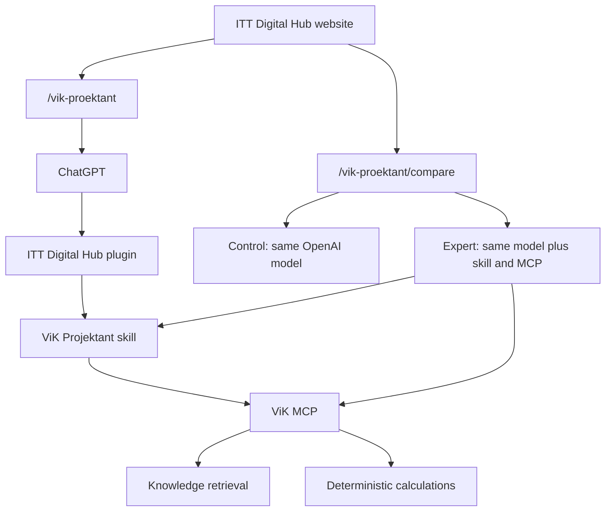

# ВиК Проектант V2 architecture

V2 is a separate product from the existing ВиК Проектант assistant (V1). V1 stays on `/bg/vik-designer` and `/en/vik-designer`, with its Agent Hub handler, prompt, retrieval and gateway route unchanged.

ChatGPT is the agent. The MCP server retrieves, validates and calculates. It does not call OpenAI, OpenRouter, Gemini or Agent Hub.

## Where the code lives

| Piece | Location |
| --- | --- |
| Plugin package | `plugins/itt-digital-hub/` |
| Skill | `plugins/itt-digital-hub/skills/vik-projektant/SKILL.md` |
| Retrieval and calculations | `src/vik-proektant/engine/` |
| MCP JSON-RPC over HTTP | `src/vik-proektant/mcp/http.ts` |
| Website MCP route | `POST /api/mcp/vik` |
| Comparison | `src/vik-proektant/comparison/` and `POST /api/vik-proektant/compare` |
| Product pages | `src/app/[locale]/vik-proektant/` |
| Corpus, read only | `Tools/WSS - AI Asistant/Вик Асистен - Знание/knowledge/` |

## Migration matrix

| Current component | V2 destination | Decision |
| --- | --- | --- |
| `/vik-designer` page and components | unchanged | V1 only |
| Agent Hub `vik-designer` prompt, handler, retrieval | unchanged | V1 only |
| Gateway `api.ittdigitalhub.org` agent routes | unchanged | V1 only |
| OpenRouter / Gemini model policy | unchanged | V1 only |
| Knowledge markdown | read-only index for V2 | Reimplement retrieval |
| V1 system prompt | professional rules rewritten as a skill | Reimplement |
| Full-corpus prompt injection | rejected | Remove from V2 |
| Conversation storage | ChatGPT owns the conversation | Remove from V2 |
| Agent Hub orchestration behind tools | not recreated | Remove from V2 |

## Plugin

The package follows the current OpenAI plugin format:

- root `plugin.json` with the Agent Plugins 1.0 schema and `extensions.com.openai`;
- `.codex-plugin/plugin.json` as the compatibility manifest used by ChatGPT and the Agents API;
- `skills/vik-projektant/`;
- portable `mcp.json` (`streamable-http`) and `.mcp.json` (`http`) for the same URL.

The public MCP URL in the package is `https://ittdigitalhub.org/api/mcp/vik`. The gateway on `api.ittdigitalhub.org` is the V1 edge and was not given a new route.

## Retrieval

The corpus is curated Bulgarian regulations in markdown with YAML frontmatter. V2 chunks it by article, ranks with lexical BM25-style scoring, exact article matching and title overlap, and collapses duplicate chunk text. There is no pgvector deployment in this project, and the MCP process does not call an embedding model. That keeps retrieval deterministic and inside the existing Next.js runtime.

## Comparison boundary

The comparison calls the OpenAI Responses API twice. Control gets a short neutral instruction and no tools. Expert gets the packaged skill text, its reference files, and a remote MCP tool entry for the same server. Responses does not accept a plugin ZIP; the Agents API can. The comparison therefore uses the Responses MCP tool plus the same skill files. ChatGPT Work loads the plugin package directly. Both paths use the same skill and the same MCP tools.

## Website

`/vik-proektant` explains the product. `/vik-proektant/compare` runs the fair comparison. The ChatGPT button reads `VIK_CHATGPT_DESTINATION_URL` and stays inactive until that HTTPS URL exists.
