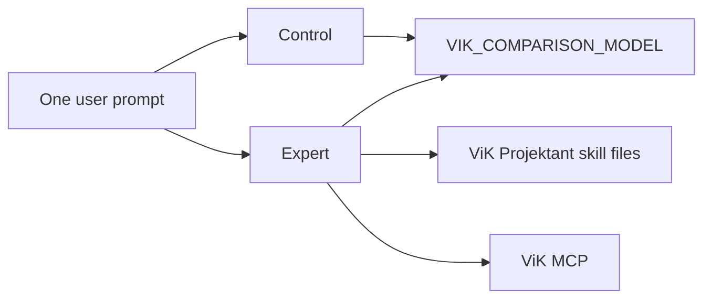

# Comparison design

The comparison asks one question of one OpenAI model, twice.

## What is the same

- Model id, from `VIK_COMPARISON_MODEL`, default `gpt-5.6`. There is no separate control or expert model.
- The user prompt string.
- `store: false`.
- `max_output_tokens`.
- Sampling fields. Temperature and top_p are omitted on both sides, so both use the API default.
- The Responses endpoint.

A successful response whose model id is neither the requested id nor a dated snapshot of that id (`gpt-5.6-...`) is hidden as `model_mismatch`. If the two resolved model ids differ, `fair` is false and the page says the comparison is not equivalent.

## Control

Instruction, exactly:

> Answer the user's question helpfully and accurately using your general model capabilities. No external ViK-specific tools or ITT domain knowledge are available.

Control has no `tools` array, no skill file, and no corpus text. The instruction does not tell the model to be generic, vague, or less capable.

If a control response nevertheless contains an MCP tool call, that side is treated as a failure and is not shown.

## Expert

Instructions are the contents of `skills/vik-projektant/SKILL.md` plus the packaged reference markdown. The only tool is the ViK MCP server. The skill tells the model when to search, when to calculate, and when to ask for missing inputs.

## What the page may show

Only facts from the response:

- how many distinct `documentId` values came back from retrieval tools;
- whether a calculation tool returned a result;
- whether a calculation tool rejected invalid input.

The page does not show a winner, a score, chain of thought, the hidden instructions, or raw tool payloads.

## Demo prompts

Six examples cover missing data, a source-backed requirement, a calculation, design reasoning, an ambiguous question, and a fabricated clause. They are starting points, not a claim that the general model fails them.

## Telemetry

The browser sends event names to Vercel Analytics without the prompt text: `comparison_started`, `comparison_completed`, `selected_example_prompt`, `custom_prompt_used`, `control_error`, `expert_error`, `expert_used_retrieval`, `expert_used_calculation`.

The server log stores a request id, the model id, latencies, tool names, retrieval counts, a short hash of the prompt, and the deployment sha. It does not store the prompt.

## Limits

The comparison represents the V2 specialization as closely as the Responses API allows. It is not itself a ChatGPT Work session, so it does not install the plugin ZIP. A local `next dev` URL is not reachable by OpenAI's MCP client; Expert tool calls succeed when `VIK_MCP_PUBLIC_URL` or the site URL is a public HTTPS address.
